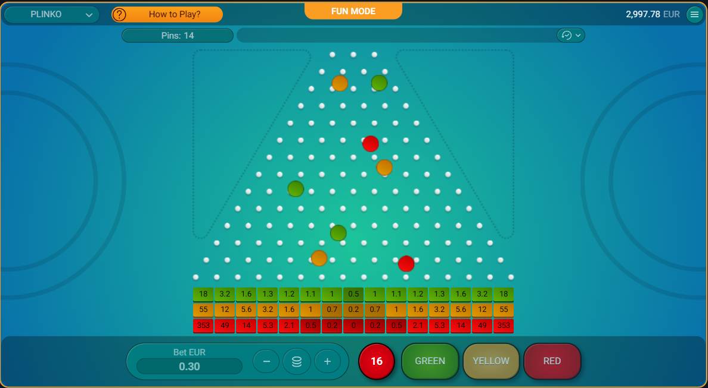

# Solana Plinko Game Smart Contract

This project implements a **Plinko** game smart contract on the **Solana** blockchain using Anchor framework. Players drop balls into a Plinko board, and rewards are determined based on the landing bucket. The game integrates randomness via the Orao VRF Oracle to ensure fairness and transparency.

[](https://t.me/TopTrenDev_66)
[](https://x.com/toptrendev)
[](https://discord.com/users/648385188774019072)

---

## 🚀 Features

- 🪙 On-chain Solana smart contract for Plinko gameplay.

- 🔑 Secure account management using PDAs (Program Derived Addresses).

- 🎰 Verifiable randomness using Orao VRF Oracle.

- 📈 Track player stats (total won, buckets hit, etc).

- 🏦 House account logic for managing payouts and balance.

- ⚡ Efficient SOL transfers using system instructions with PDA signing.

- ✅ Tested and structured using Anchor framework.

---

## ⚙️ How It Works

- Start a game

The player calls play_game, placing a bet and specifying parameters (e.g., number of balls).

- Request randomness

The contract makes a request to Orao VRF.

- Fulfill randomness

Orao VRF provides random numbers; the contract processes them via fulfill_random_words.

- Determine payouts

Based on bucket indexes, payouts are computed and distributed between player and house.

- Update stats

Game, house, and user statistics are updated on-chain.

---

## 📸 Screenshot



---

## 🔑 Example Deployment

- Build the program

```
anchor build
```

- Deploy to localnet or devnet

```
anchor deploy
```

- 🧪 Running Tests

```
anchor test --skip-build --skip-deploy
```
